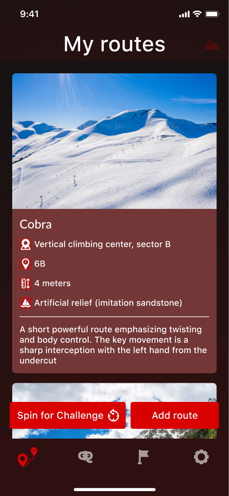
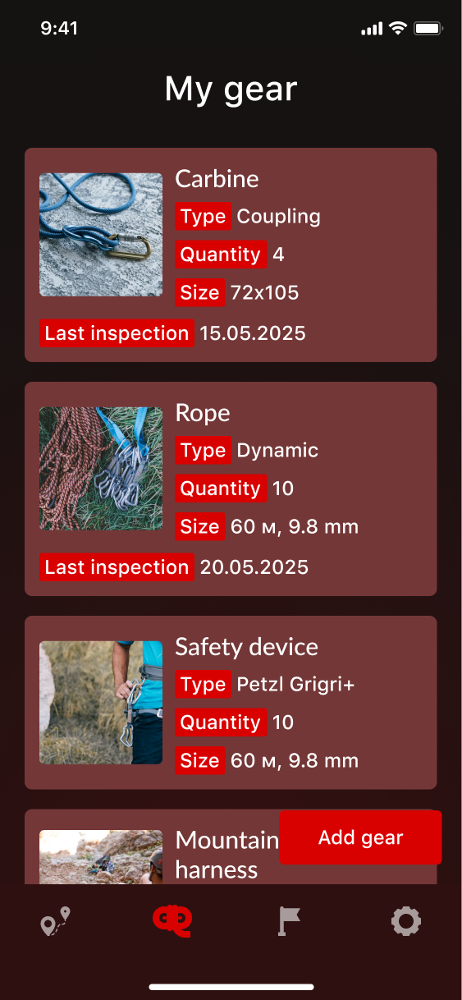

# Piton: Memorize Every Route

**Piton: Memorize Every Route** is a Flutter climbing companion app that helps climbers track their routes, manage gear, and reflect on their achievements. Plan, document, and analyze your climbing progress while keeping your equipment in top condition.


## 🛠️ Technologies

- **Flutter** and **Dart**
- **Provider** — state management
- **Hive** — local storage for routes and gear
- **Themed UI** — dark-first climbing-oriented palette
- **Custom components** — route cards, achievements, and gear inventory
- **Local assets** — images and resources included in the project

## 📱 Screenshots

| Routes | Gear | Achievements |
|--------|------|--------------|
|  |  |  |

## 🚀 How to Run

1. Clone the repo
   ```sh
   git clone https://github.com/NMMustafina/piton_memorize_every_route.git
   ```
2. Install all the packages by typing the following command
   ```sh
   flutter pub get
   ```
3. Run the App
